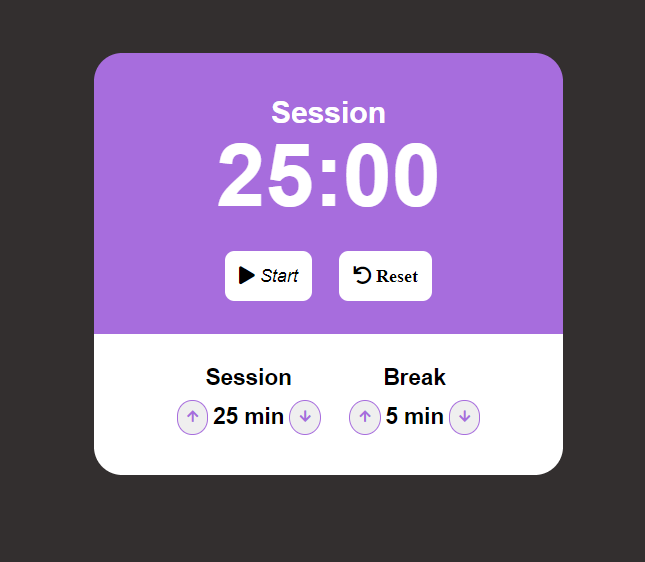

# Pomodoro
## É um método de gerenciamento de tempo desenvolvido por Francesco Cirillo no final dos anos 1980. A técnica consiste na utilização de um cronômetro para dividir o trabalho em períodos de 25 minutos, separados por breves intervalos.

# Características Principais

<!--ts-->
  * O usuário pode ver um cronômetro de 25 minutos - Sessão de trabalho.
  * Com o término da sessão de trabalho, o usuário pode ver um cronômetro de 5 minutos - Sessão de intervalo.
  * O usuário pode iniciar / pausar, parar e redefinir os temporizadores.
  * O usuário pode ouvir um som tocando quando o cronômetro chegar no 00:00.
  * O usuário pode alterar os minutos das duas sessões antes de começar.
<!--te-->
